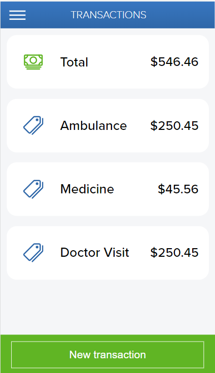

# Ruby on Rails Budget App

> This is a mobile web application where you can manage your budget: Users have a list of transactions associated with a category, the user see how much money you spent and on what.

More screenshots

## 📋 Menu Drawer

## 📋 Desktop Version

 

## Production Link

[YourBudget.com](https://serene-hamlet-05104.herokuapp.com/)

## Built With

- Ruby
- Ruby on Rails
- CSS
- PostgreSQL
- Devise

## Getting Started

To get a local copy up and running follow these simple example steps.

### Prerequisites

- Ruby
- Ruby on Rails 
- Terminal

### Setup

git clone https://github.com/RafaelEchart/Rails_BudgetApp.git

### Install

Run in the terminal to install the gems:

`bundle install`

### Usage

To run the Rails server, in the terminal: 

`rails s`

## Author

👤 **Rafael Echart**

- GitHub: [@RafaelEchart](https://github.com/rafaelechart)
- Twitter: [@RafaelEchart](https://twitter.com/rafaelechart)

## 🤝 Contributing

Contributions, issues, and feature requests are welcome!

## Show your support

Give a ⭐️ if you like this project!

## Acknowledgments

- Ruby and Ruby on Rails Documentation
- Microverse Guidelines
- Thanks to [Gregoire Vella](https://www.behance.net/gregoirevella) for creating this [amazing layout ⭐️](https://www.behance.net/gallery/19759151/Snapscan-iOs-design-and-branding?tracking_source=)
- Rafael Echart

## 📝 License

This project is [MIT](./MIT.md) licensed.